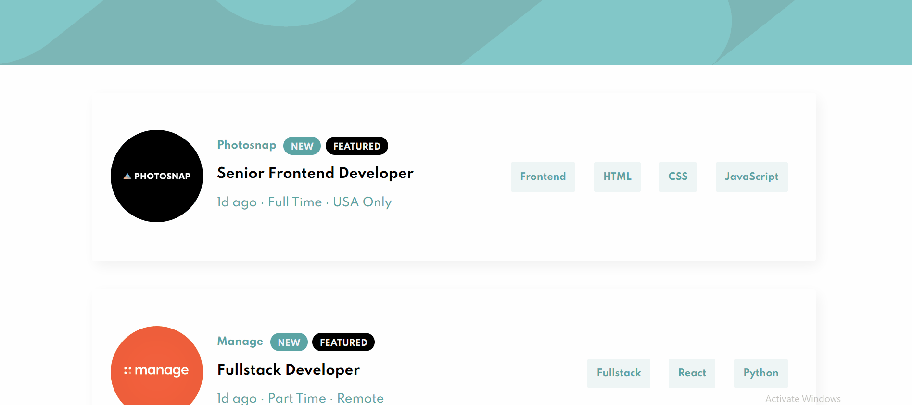

# REACT JS - Job Listings Component

## Welcome! 👋

Thanks for checking out this front-end coding project. Here is a link to a [LIVE DEMO](https://github.com/ramos-codes/job_listings_component)
The design reference was provided to me by [Frontend Mentor](https://www.frontendmentor.io/) , a site that hosts challenges that allow you to improve your skills in a real-life workflow.

## Project Details

This project is one of the earlier works of mine, something I did to get my feet wet with React.js and CSS.

- The component itself uses Javascript to filter out a list of job posts with tags.
- The CSS styling matches to reference design images given to me

This project helped me grow and understand more about developing.
